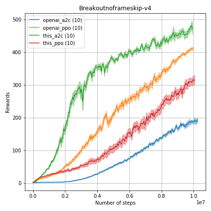
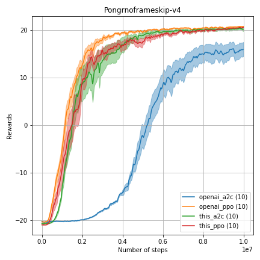
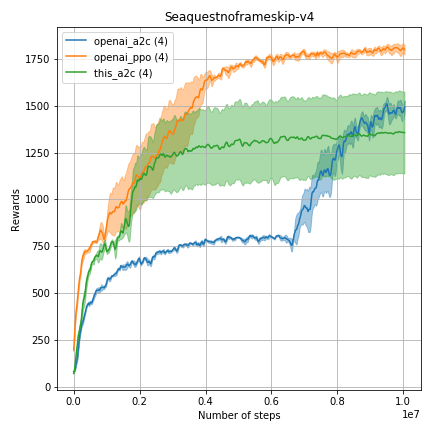
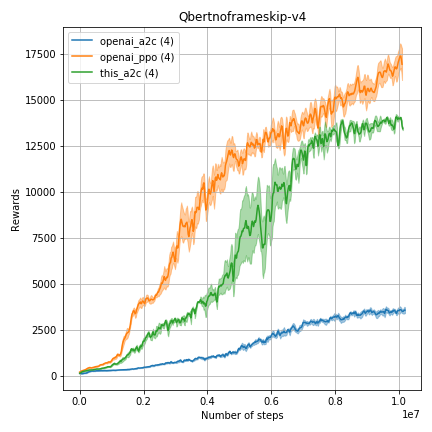
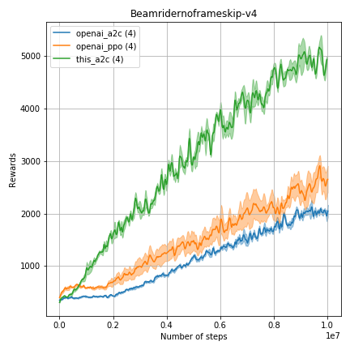

# Efficient Tensorflow 2.x implementation of Advantage Actor Critic (A2C) and Proximal Policy Optimization (PPO, currently WIP)

This implementation of Advantage Actor Critic (A2C) and Proximal Policy Optimization Algorithm (PPO) use the advantages of Tensorflow 2.x. In particular, new model API and graph optimization with tf.function. On AMD Ryzen 7 2700X and Nvidia GTX 2070 A2C can run ~2000 FPS for PongNoFrameskip-v4.

See the [OpenAI blog post](https://blog.openai.com/baselines-acktr-a2c/) for details regarding A2C.
Also see [PPO](https://arxiv.org/pdf/1707.06347.pdf) for details regarding PPO.   

## Visualization

In order to visualize the results use ```visualize.ipynb```.

## Training
### A2C
```bash
 python main.py --env_name PongNoFrameskip-v4 --algo-a2c --logs_dir logs/pongnoframeskip
```
### PPO
```bash
 python main.py --env_name PongNoFrameskip-v4 --algo-ppo --logs_dir logs/pongnoframeskip
```
## Acknowledgements

I used the following repositories for reference:
* [OpenAI baselines](https://github.com/openai/baselines)
* [PyTorch PPO-A2C-Acktr](https://github.com/ikostrikov/pytorch-a2c-ppo-acktr-gail)


Thanks for help to [@ikostrikov](https://github.com/ikostrikov).

## Results
This implementation performs on par with OpenAI baselines implementations of [A2C](https://github.com/openai/baselines/) and [PPO](https://github.com/openai/baselines/)











